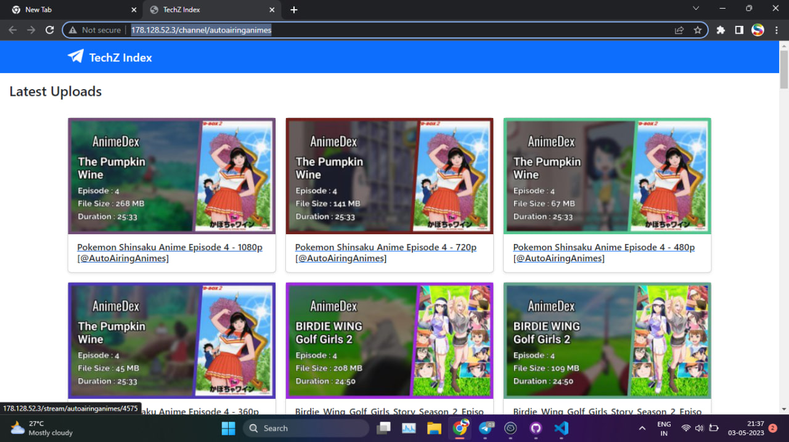
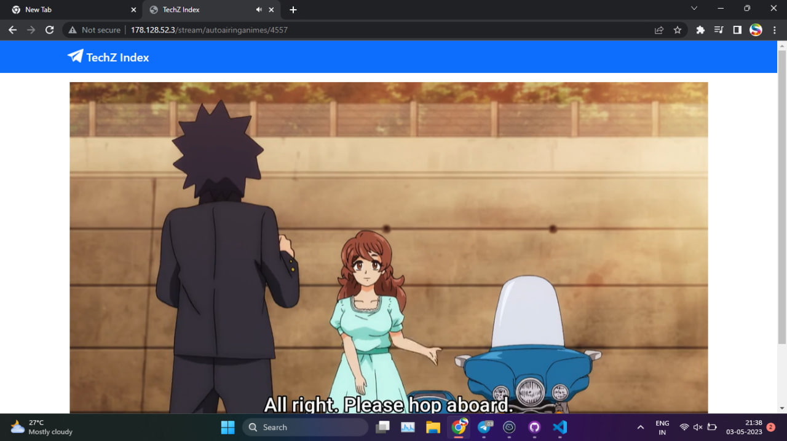

<h1 align="center"><a href="https://github.com/TechShreyash/TechZIndex"></a></h1>
<h2 align="center"><a href="https://github.com/TechShreyash/TechZIndex"><b>Index Telegram Files Over Your Website</b></a></h4>

<hr>

### Join For Latest Updates

[](https://telegram.me/TechZBots) [](https://telegram.me/TechZBots_Support)

<hr>

- Built With Flask In Python
- Fast And Responsive
- Improved TechZIndex
- Some files not showing prob fixed ( ig )
- Your channel's files on first visit get cached on server, so that userbot doest have to fetch your channel again and again ( to avoid floodwait )

> You can request the cache to be removed manually by admins of bot

<hr>

### ♻️ How To Use ?

- Make Bot admin in your channel
- Your channel must be public
- Now open this link ```BASE_URL/channel/<your channel username>```

<hr>

### Screenshots





<hr>

### Config Vars

```
API_ID = ""
API_HASH = ""
BOT_TOKEN = ""
STRING_SESSION = ""
OWNER_ID = ""
ADMINS = [1693701096]
BASE_URL = ""
HOME_PAGE_REDIRECT = "https://techzbots.t.me"
```

<hr>
